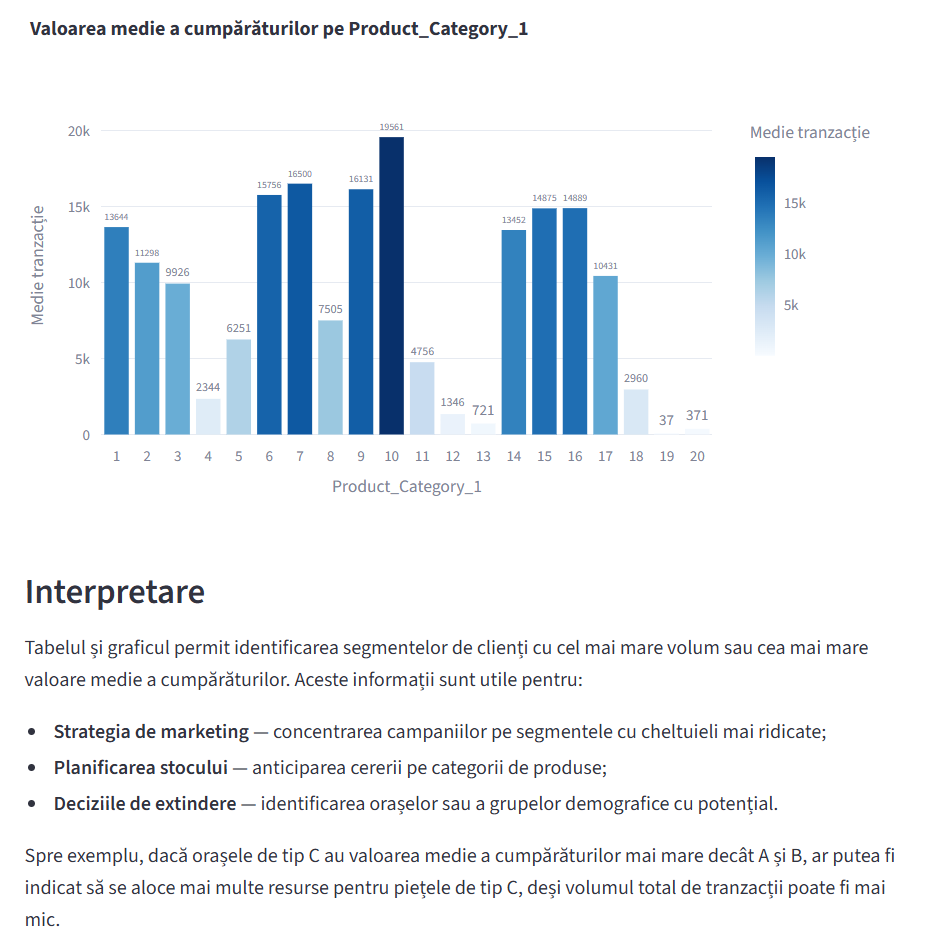
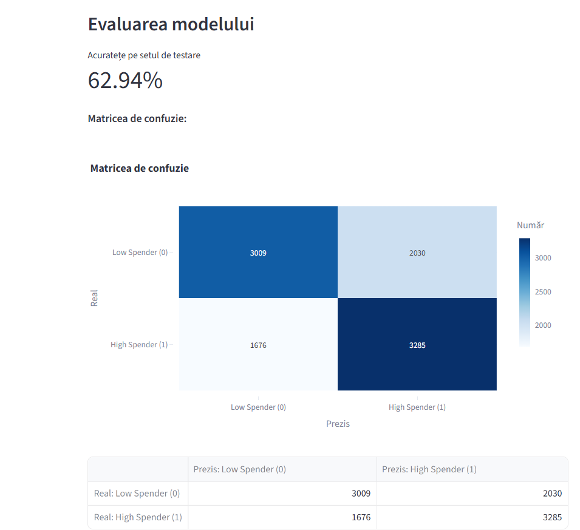

# Black Friday Customer Analysis

Data analysis and machine learning project developed using **Python, Streamlit and SAS** on the Analytics Vidhya Black Friday dataset.

## Main Features

- Data preprocessing and missing value handling
- Categorical encoding using `LabelEncoder`
- Feature scaling with `StandardScaler` and `MinMaxScaler`
- Descriptive statistics and aggregation with `pandas`
- Interactive visualizations using `Plotly`
- Customer segmentation using **K-Means**
- **Logistic Regression** for High Spender classification
- **Multiple Linear Regression (OLS)** for purchase value prediction
- Interactive interface built with **Streamlit**
- Parallel analysis in **SAS**

## Dataset

Original dataset:

- 550,068 transactions
- 5,891 unique customers
- 3,631 products
- 12 variables

A reproducible sample of approximately **50,000 transactions** was used for the Python and SAS analyses.

## Application Preview

## Application Preview

### Descriptive Statistics



### K-Means Customer Segmentation


### Logistic Regression



### Multiple Linear Regression


## Machine Learning

### K-Means Clustering

Customers are aggregated by:

- total purchase value
- number of transactions

The features are standardized before applying:

```python
KMeans(n_clusters=4, random_state=42, n_init=10)
```

This produces four customer segments: Occasional, Loyal, Premium and VIP.

### Logistic Regression

Binary classification of transactions into:

- High Spender
- Low Spender

The target is defined using the median purchase value.

Model accuracy:

```text
62.94%
```

### Multiple Linear Regression

Implemented using `statsmodels.OLS`.

Results:

```text
R² = 0.1225
RMSE ≈ 4608.88
MAE ≈ 3539.43
```

## Technologies

```text
Python
pandas
scikit-learn
statsmodels
Plotly
Streamlit
SAS
```

## Run the Application

Install dependencies:

```bash
pip install -r requirements.txt
```

Run Streamlit:

```bash
streamlit run Intro.py
```

## Data Source

Analytics Vidhya – Black Friday DataHack

## Authors

Gabriela Adăscăliței
Oana Alexe
